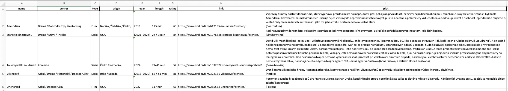

# CSFD parser

Get details about all your movies you marked as _Want to watch_ at [CSFD.cz](https://csfd.cz).

## Setup

1. Install [poetry](https://python-poetry.org/)
2. `poetry install`

## Usage

1. Download HTML source code from each page from https://www.csfd.cz/soukrome/chci-videt/ and save it into `data/`
2. Run the app `poetry run python app.py`
3. Enjoy the result in `movies.xlsx`
